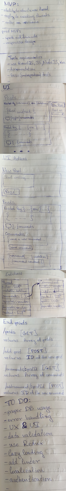

# Reddit Like App User Documentation

## User Documentation

For general usage and look of the application please see the UserDocumentation.md file - [User Documentation](./UserDocumentation.md)

## Client Components Documentation

For how the client component signatures please see the auto-generated documentation located at client/styleguide/index.html - [Components Docs](../styleguide/index.html)

## API documentation

For how the server end-points work see the ApiDocumentation.md file - [Api Documentation](./ApiDocumentation.md)

## NOTES:

For the purposes of this demo app many of the functionalities are pretty basic or missing. E.g. posts can be only plain text, there is no authentication system, partial error handling, etc.

Below you can see the **initial sketches** from the planning phase of the application.

